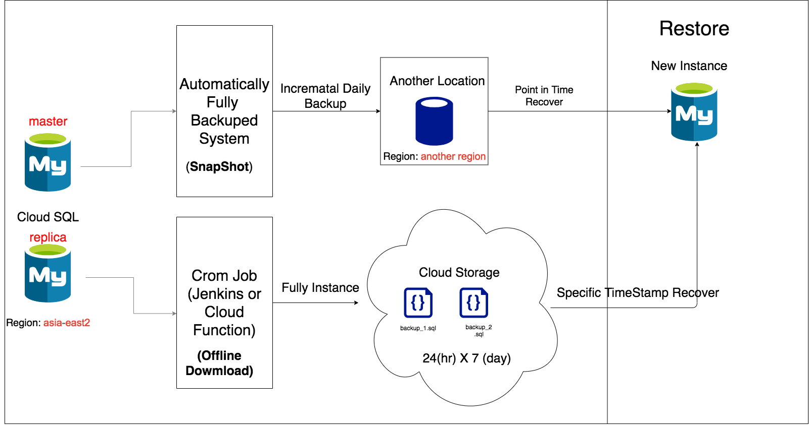

# Cloud SQL Disaster Recover

## Cloud SQL Restore Flow

Cloud SQL 遇到不預期停止，須建立備份還原系統，以下是兩種備份還原方式。

1. **SnapShot** : 使用Cloud SQL內建的自動備份系統 (建Instance時，需勾選**自動備份**及**啟用時間點復原**)，建立不同於Cloud SQL Instance的Region的備份資料，以防止當地Region 的Instance 無法正常運作時，能夠從其他Region做災難還原。

2. **OfflineDownload** : 建立一套排程工作，使用mysqldump 在異地端備份整個Instance，以防止整個Cloud SQL 無法運作時，能夠在其他VM或其他SAAS服務做還原。



##  SnapShot 還原 (Cloud Shell)


### 1. 列出backup ID，找出需要的備份時間點
gcloud sql backups list \\
--instance=**INSTANCE_NAME** \\ 
--project **PROJECTID**


Ex:
```
gcloud sql backups list --instance=dbbackup-1-clone --project dbbackup-311906
```

### 2. Create New Instance 

gcloud sql instances create **INSTANCE_NAME**  \\
--database-version=**VERSION** \\
--tier=**MACHINE_TYPE**  \\
--region=**REGION** \\
--root-password=**PASSWORD**


Ex:
```
gcloud sql instances create prod-instance  --database-version=MYSQL_8_0 --tier=db-g1-small  --region=asia-east2 --root-password=pass.123
```


### 3. 指定Backup Id , Restore 到新的Instance
gcloud beta sql backups restore **BACKUP_ID** \\
--restore-instance=**NEW_INSTANCE** \\
--backup-instance=**OLD_INSTANCE**

Ex:
```
gcloud beta sql backups restore 1619624520000 --restore-instance=dbbackup-1-clone --backup-instance=dbbackup-1-clone
```

## Offline Download 還原 (Cloud Shell)


### 1. 建立Cloud Storage

在Cloud SQL Project Owner 帳號下此語法
gsutil mb -b on -l **REGION** gs://**BUCKET_NAME**/

Ex:
```
gsutil mb -b on -l us-east1 gs://backup-sql-rex/
```

### 2. 給予剛創立的 Cloud Storage 權限 

###### 查詢 Cloud SQL 的 Service Account
gcloud sql instances describe **OLD_INSTANCE_NAME** \\
--format="value(serviceAccountEmailAddress)"
###### 給予 Cloud Storage 對應 Cloud SQL Service Account 權限

gsutil iam ch serviceAccount:**SERVICE_ACCOUNT**:legacyBucketOwner \\
gs://**BUCKET_NAME**/

Ex:
```
SAName=$(gcloud sql instances describe dbbackup-1-clone --format="value(serviceAccountEmailAddress)")

gsutil iam ch serviceAccount:${SAName}:legacyBucketOwner gs://backup-sql-rex/

```

### 3. Export To Cloud Storage

gcloud sql export sql **OLD_INSTANCE_NAME** --offload gs://**BUCKET_NAME**/**FILENAME**.tar.gz

Ex:
```
gcloud sql export sql dbbackup-1-clone --offload gs://backup-sql-rex/2021_05_10_backup_sql.tar.gz
```

----
### Restore

### 4. Create New Instance 

gcloud sql instances create **INSTANCE_NAME**  \\
--database-version=**VERSION** \\
--tier=**MACHINE_TYPE**  \\
--region=**REGION** \\
--root-password=**PASSWORD**


Ex:
```
gcloud sql instances create prod-instance  --database-version=MYSQL_8_0 --tier=db-g1-small  --region=asia-east2 --root-password=pass.123
```

### 5. Import To New Instance

gcloud sql import sql **INSTANCE_NAME**
gs://**BUCKET_NAME**/**FILENAME**.tar.gz

Ex:
```
gcloud sql import sql prod-instance gs://backup-db1234/backup-sqldb.tar.gz
```
