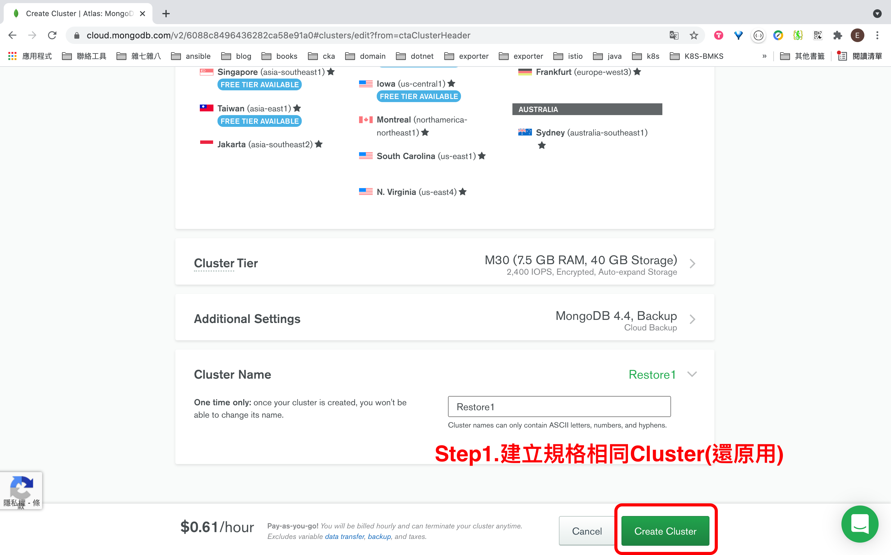
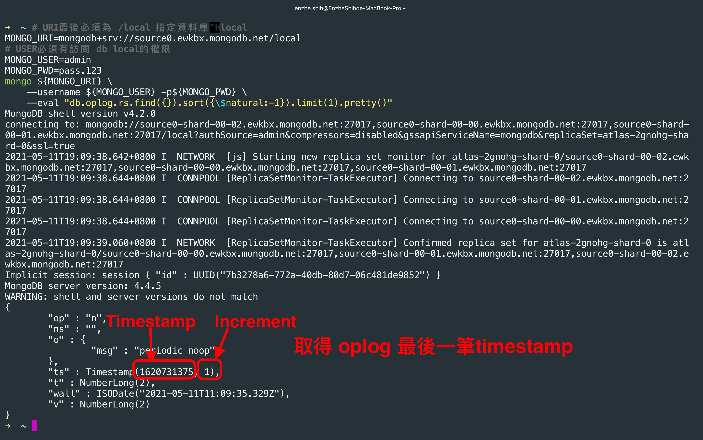
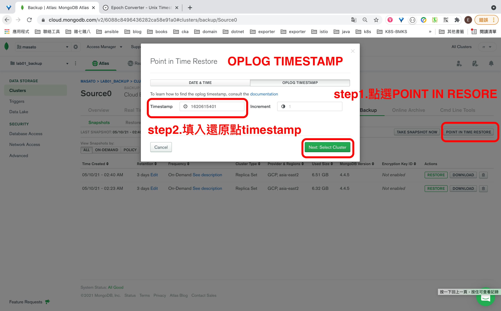
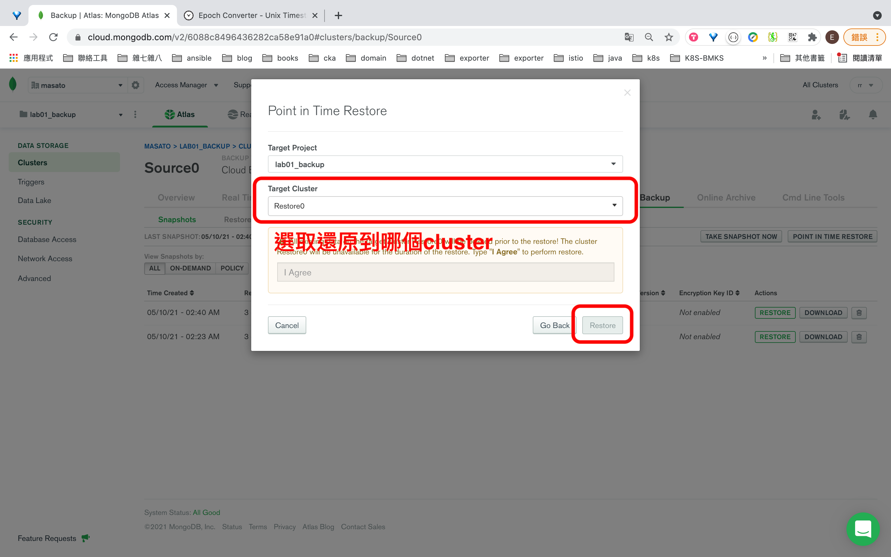
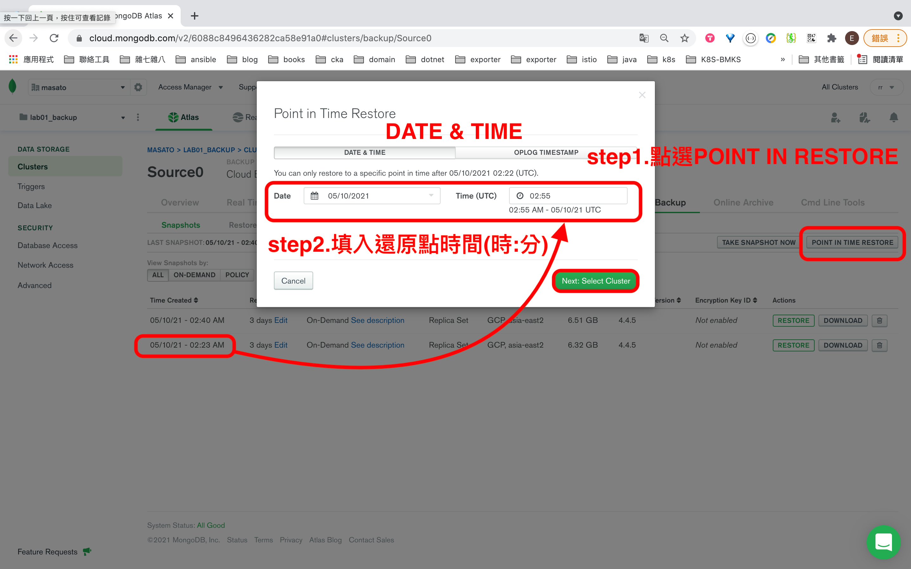
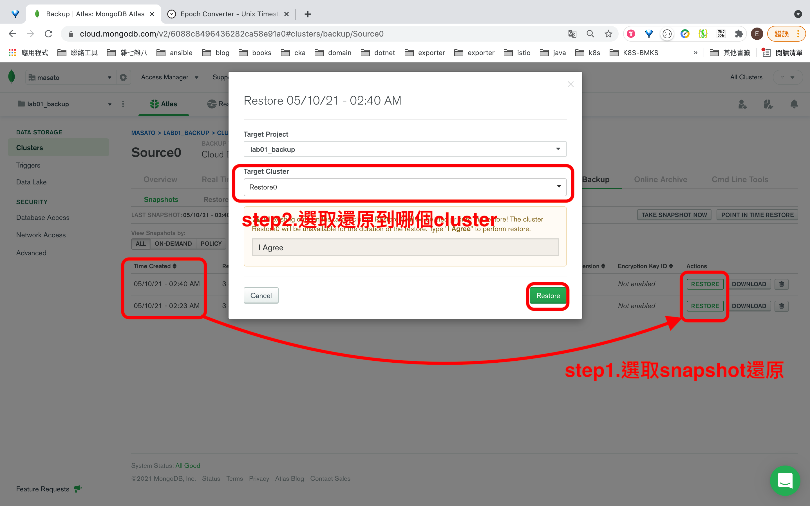

## MongoDB Atlas Restore Data

### 情境
原有MongoDB Altas 內的 DB instance 無法提供正常服務，需要把資料還原到新的 DB Instance (依舊使用雲端託管的 MongoDB Altas)


### 還原步驟


#### Step1. 建立規格相同Cluster(還原用)



#### Step2. 依情境選取適合的還原方法

 1. Point in Time Restore - OPLOG TIMESTAMP
    - 優點:
        - 精度最高，可還原到**秒**級
    - 缺點:
        - 必須訪問mongodb取得最後oplog timestamp
    - 步驟:
        1. 取得oplog最後一筆timestamp

            ```shell

            #參數設定
            # MONGO_URI 最後必須為 /local 指定資料local
            MONGO_URI=mongodb+srv://source0.ewkbx.mongodb.net/local
            # MONGO_USER必須有訪問 db local的權限
            MONGO_USER=admin
            MONGO_PWD=pass.123

            # 取得oplog最後一筆timestamp
            mongo ${MONGO_URI} \
                --username ${MONGO_USER} -p${MONGO_PWD} \
                --eval "db.oplog.rs.find({}).sort({\$natural:-1}).limit(1).pretty()"
            ```
            

        2. 設定還原點
            

        3. 選取還原用Cluster，執行還原 

            - **還原時間點太新 可能需要多按幾次**
            

 2. Point in Time Restore - DATE & TIME
    - 缺點:
        - 精度普通，可還原到**分鐘**級
    - 步驟:
        1. 設定還原點
            
        2. 選取還原用Cluster，執行還原
            

 3. Restore from Snapshot
     - 優點:
        - snapshot可離線下載做備份
     - 缺點:
        - 精度最低，還原到上次最後備份點(**小時**級)
    - 步驟:
        - 選取欲還原的snapshot
            