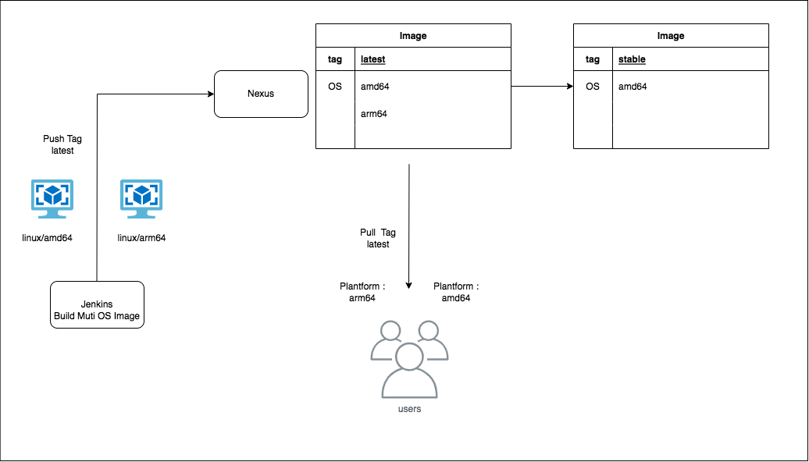
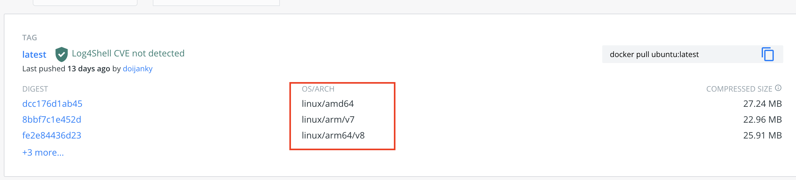

# Multi-Arch Builds Image Guide
Linux 服務器 CPU 架構主要可分爲：X86_64/AMD64、ARM64/AARCH64 兩大類，因應Docker使用者，在不同CPU架構下的開發，Docker需支援不同的CPU環境。
使用多架構鏡像，可以讓Docker根據使用者系統架構去拉取鏡像，服務的部署腳本等可以在架構的系統間使用相同的配置或是相同版號，提高服務在不同系統架構間的一致。


### Soluction
目前 Docker 有兩種方法可以建立 multi-arch image：Manifest 以及 Buildx

1.  **Manifest**
   先建立出多種不同平台的鏡像，最後創建一個manifest list 方式引用不同平台的鏡像
2.  **Buildx** 
   透過指令 `$ docker buildx build` 使用BuildKit建構鏡像，一次可以parallel建立出不同平台的鏡像，大大簡化了建構步驟

##  1. Manifest
####  Setup
1. 安裝 qemu 模擬器 （Docker Destop For Mac 不需額外安裝）
   `docker run --rm --privileged multiarch/qemu-user-static --reset -p yes`

####  Build

1. DockerFile 在拉取 image前指定 `platform`，需確認 Docker Hub 有需要的OS Image

   

   DockerFile:
   ```
   ARG platform
   FROM --platform=$platform ubuntu:20.04
   RUN apt-get update && apt-get install -y curl
   ```
1. 透過`--build-arg` 給予不同架構參數 Build 出兩顆不同架構的image Tag
   ```
   #AMD64
   $ docker build -t team.sb.rexbet.com:8082/multiarch-example:manifest-amd64 --build-arg platform=linux/amd64 .
   $ docker push team.sb.rexbet.com:8082/multiarch-example:manifest-amd64

   #ARM64
   $ docker build -t team.sb.rexbet.com:8082/multiarch-example:manifest-arm64 --build-arg platform=linux/arm64 .
   $ docker push team.sb.rexbet.com:8082/multiarch-example:manifest-arm64
   ```
3. 透過create manifest list方式，將剛剛build出的鏡像引用成一個 `multiarch-example:manifest`
   ```
   docker manifest create --insecure team.sb.rexbet.com:8082/multiarch-example:manifest \
   --amend team.sb.rexbet.com:8082/multiarch-example:manifest-amd64 \
   --amend team.sb.rexbet.com:8082/multiarch-example:manifest-arm64
   ```

4. 用manifest方式push回 docker hub

   ```
   docker manifest push --insecure team.sb.rexbet.com:8082/multiarch-example:manifest
   ```

5. 檢查是否為兩個平台的image

   ```
   docker manifest inspect --insecure team.sb.rexbet.com:8082/multiarch-example:manifest
   ```

output:

   ```
   {
      "schemaVersion": 2,
      "mediaType": "application/vnd.docker.distribution.manifest.list.v2+json",
      "manifests": [
         {
            "mediaType": "application/vnd.docker.distribution.manifest.v2+json",
            "size": 740,
            "digest": "sha256:68b6ebaa716bd3f6b86ee1e3390729fb214ac9776b338bc45800653e4a2557c5",
            "platform": {
               "architecture": "amd64",
               "os": "linux"
            }
         },
         {
            "mediaType": "application/vnd.docker.distribution.manifest.v2+json",
            "size": 740,
            "digest": "sha256:8a67ff1262d671a098619f562c456d23f7a779973b4367440e4a9f54af3663f3",
            "platform": {
               "architecture": "arm64",
               "os": "linux",
               "variant": "v8"
            }
         }
      ]
   }
   ```
6. `docker run` 確認本地跑的container下的cpu架構為何
   ex:
   ```docker run --rm team.sb.rexbet.com:8082/multiarch-example:manifest ```
   output: x86_64
---

##  2. Buildx

####  setup


1. 若Sever為linux base，kernel 版本必須 >= 4.8
2. 安裝模擬器 `qemu`
    ```docker run --privileged --rm tonistiigi/binfmt --install all```
   參考：[Install Qemu](https://docs.docker.com/buildx/working-with-buildx/#:~:text=%E7%82%BA%E4%BA%86%E8%AE%93%E5%9C%A8%E4%B8%BB%E6%A9%9F%E6%93%8D%E4%BD%9C%E7%B3%BB%E7%B5%B1%E4%B8%8A%E8%A8%BB%E5%86%8A%E7%9A%84%20QEMU%20%E4%BA%8C%E9%80%B2%E8%A3%BD%E6%96%87%E4%BB%B6binfmt_misc%E5%9C%A8%E5%AE%B9%E5%99%A8%E4%B8%AD%E9%80%8F%E6%98%8E%E5%9C%B0%E5%B7%A5%E4%BD%9C%EF%BC%8C%E5%AE%83%E5%80%91%E5%BF%85%E9%A0%88%E9%9D%9C%E6%85%8B%E7%B7%A8%E8%AD%AF%E4%B8%A6%E4%BD%BF%E7%94%A8fix_binary%E6%A8%99%E8%AA%8C%E8%A8%BB%E5%86%8A%E3%80%82%E9%80%99%E9%9C%80%E8%A6%81%E5%85%A7%E6%A0%B8%20%3E%3D%204.8%20%E5%92%8C%20binfmt%2Dsupport%20%3E%3D%202.1.7%E3%80%82%E6%82%A8%E5%8F%AF%E4%BB%A5%E9%80%9A%E9%81%8E%E6%AA%A2%E6%9F%A5%E6%98%AF%E5%90%A6F%E5%9C%A8%20/proc/sys/fs/binfmt_misc/qemu%2D*.%20%E9%9B%96%E7%84%B6%20Docker%20Desktop%20%E9%A0%90%E9%85%8D%E7%BD%AE%E4%BA%86binfmt_misc%E5%B0%8D%E5%85%B6%E4%BB%96%E5%B9%B3%E5%8F%B0%E7%9A%84%E6%94%AF%E6%8C%81%EF%BC%8C%E4%BD%86%E5%B0%8D%E6%96%BC%E5%85%B6%E4%BB%96%E5%AE%89%E8%A3%9D%EF%BC%8C%E5%AE%83%E5%8F%AF%E8%83%BD%E9%9C%80%E8%A6%81%E4%BD%BF%E7%94%A8tonistiigi/binfmt%20%E6%98%A0%E5%83%8F%E9%80%B2%E8%A1%8C%E5%AE%89%E8%A3%9D%E3%80%82)
   
   **註：以上Docker for Mac Destop 不需安裝**

   ---

3. 建立Muti-Arch的Builder
   
   因應內網Nexus Registry 未設定TLS協定，需調整 buildkit的 buildkitd.toml 設定檔。將registry設定為insecure

   ```sh
   #設定daemon config
   vi /etc/buildkit/buildkitd.toml
   debug = true
   insecure-entitlements = [ "network.host", "security.insecure"]
   [registry."team.sb.rexbet.com:8082"]
   mirrors = ["team.sb.rexbet.com:8082"]
   http = true
   insecure = true

   #Create builder
   docker buildx create --name mutli-platform-builder --config /etc/buildkit/buildkitd.toml --driver-opt network=host --use
   #Init 
   docker buildx inspect --bootstrap

#### Build

1. Docker File 不需要額外修改，需確認docker hub 有需要的OS Image。

   DockerFile:
   ```
   FROM ubuntu:20.04
   RUN apt-get update && apt-get install -y curl
   ```

2. Buildx 透過 `--platform` 指定平台

   ```
   docker buildx build --platform linux/amd64,linux/arm64 -t team.sb.rexbet.com:8082/multiarch:buildx --output=type=registry,registry.insecure=true --push .
   ```

3. 檢查是否為兩個平台的image

   ```
   docker buildx imagetools inspect team.sb.rexbet.com:8082/multiarch:buildx
   ```

   output:
   ```
   Name:      team.sb.rexbet.com:8082/multiarch:buildx
   MediaType: application/vnd.docker.distribution.manifest.list.v2+json
   Digest:    sha256:be5dabced982d99e5eb4503dc09e4fd84abcdbcd009a478652de6692a3ec26e0

   Manifests:
     Name:      team.sb.rexbet.com:8082/multiarch:buildx@sha256:e1dd563cc15edb8a7d51384f1a37cf74964578dc58a5197a90a953897133b844
     MediaType: application/vnd.docker.distribution.manifest.v2+json
     Platform:  linux/amd64

     Name:      team.sb.rexbet.com:8082/multiarch:buildx@sha256:b27af3057b24f6b0a580cb7b6905e631690766f5ead74b1ba80beba83733a5f8
     MediaType: application/vnd.docker.distribution.manifest.v2+json
     Platform:  linux/arm64
   ```
4. `docker run` 確認本地跑的container下的cpu架構為何
   ex:
   ```docker run --rm team.sb.rexbet.com:8082/multiarch-example:buildx ```
   output: x86_64