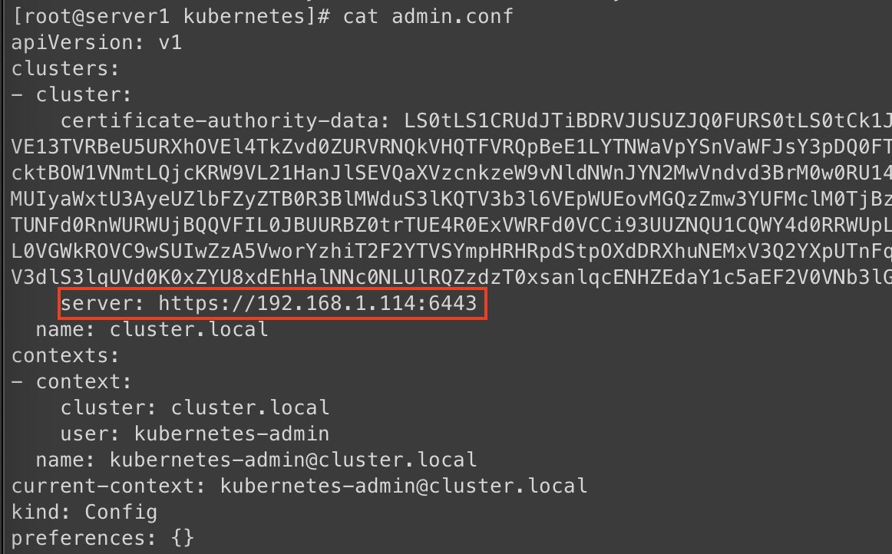

# Kubernetes x509 certificate has expired

在建立 Kubernetes 集群的時候，Master、Etcd 等證書通常有效期限為10年或是以上。
但是 `kubelet` 的證書默認為1年，所以集群運行1年後就會遇到這次的錯誤。

## 檢查方式

用 root 或是有執行權限的帳號在 Master node 執行下面的語法來檢查`集群`的證書是否過期

```bash
cd /etc/kubernetes/pki
openssl x509 -in apiserver.crt -noout -text |grep ' Not '
```


在任意節點執行下面的語法來檢查`各節點`的`kubelet`證書是否過期

```bash
NODE_IP=10.65.23.2
echo -n | openssl s_client -connect ${NODE_IP}:10250 2>&1 | sed -ne '/-BEGIN CERTIFICATE-/,/-END CERTIFICATE-/p' | openssl x509 -text -noout | grep Not
```


## 手動延長 kubelet 證書 (效期1年)

**以下的動作都在 Master Node 執行**

1. 備份現有憑證
   ```bash
   cp -R /etc/kubernetes/ssl /etc/kubernetes/ssl.backup
   cp /etc/kubernetes/admin.conf /etc/kubernetes/admin.conf.backup
   cp /etc/kubernetes/controller-manager.conf /etc/kubernetes/controller-manager.conf.backup
   cp /etc/kubernetes/kubelet.conf /etc/kubernetes/kubelet.conf.backup
   cp /etc/kubernetes/scheduler.conf /etc/kubernetes/scheduler.conf.backup
   ```

2. 利用 kubeadm renew 憑證
   ```bash
   kubeadm alpha certs renew apiserver-kubelet-client
   kubeadm alpha certs renew apiserver
   kubeadm alpha certs renew front-proxy-client
   kubeadm alpha kubeconfig user --client-name system:kube-controller-manager > /etc/kubernetes/controller-manager.conf
   kubeadm alpha kubeconfig user --client-name system:kube-scheduler > /etc/kubernetes/scheduler.conf
   kubeadm alpha kubeconfig user --client-name system:node:$HOSTNAME --org system:nodes > /etc/kubernetes/kubelet.conf
   kubeadm alpha kubeconfig user --client-name kubernetes-admin --org system:masters > /etc/kubernetes/admin.conf
   ```

3. 檢查新建立的憑證內 server 的 url 是否為內網 ip，不是的話必須手動修正

   檢查 `admin.conf`, `controller-manager.conf`, `kubelet.conf`, `scheduler.conf`
   ```
   cat /etc/kubernetes/admin.conf
   cat /etc/kubernetes/controller-manager.conf
   cat /etc/kubernetes/kubelet.conf
   cat /etc/kubernetes/scheduler.conf
   ```

   

4. 重新啟動 control-plane ，更新組件證書
   
   刪除 control-plane container 並重啟kubelet
   ```bash
   docker rm -f `docker ps | grep k8s_kube-apiserver | cut -d" " -f1`
   docker rm -f `docker ps | grep k8s_kube-controller-manager | cut -d" " -f1`
   docker rm -f `docker ps | grep k8s_kube-scheduler | cut -d" " -f1`

   systemctl restart kubelet
   ```

5. 將憑證複製到其他的 Master node 並重新啟動 control-plane
   > 這個步驟主要是有複數的 Master Node 架構才需要執行
   
   ```bash
   cd /etc/kubernetes
   scp pki/* root@${other_master}:/etc/kubernetes/pki/
   scp *.conf root@${other_master}:/etc/kubernetes/

   docker rm -f `docker ps | grep k8s_kube-apiserver | cut -d" " -f1`
   docker rm -f `docker ps | grep k8s_kube-controller-manager | cut -d" " -f1`
   docker rm -f `docker ps | grep k8s_kube-scheduler | cut -d" " -f1`
   
   systemctl restart kubelet
   ```

6. 複製新的憑證供 Terminal 使用, 如果有不同的 user, Master Node 需要執行 kubelet 都必須執行
   ```bash
   cp /etc/kubernetes/admin.conf ~/.kube/config
   ```

7. 更新 Jenkins 的憑證
   ```bash
   cat ~/.kube/config
   ```
   將更新後的~/.kube/config上傳至Jenkins
   

**以下的動作在 全部 Kubernetes Node 執行**

1. 備份現有憑證
   ```bash
   mv /var/lib/kubelet/pki/kubelet.crt /tmp
   mv /var/lib/kubelet/pki/kubelet.key /tmp
   ```
2. 重新啟動 kubelet 更新證書

   ```bash
   systemctl restart kubelet
   ```

3. **全部節點**都更新完證書後，重新啟動 apiserver 加載kubelet新證書

   ```bash
   kubectl delete pod -l component=kube-apiserver -n kube-system
   kubectl delete pod -l component=kube-controller-manager -n kube-system
   kubectl delete pod -l component=kube-scheduler -n kube-system
   ```