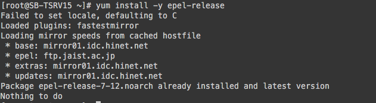

# CentOS 7 升级 CentOS 8 包含 Kernel 5 脚本与说明

## 安装前环境确认
1. OS: CentOS 7.8.2003
2. Kernel: 4.19.113-300.el7.x86_64
```<bash>
cat /etc/redhat-release && uname -r
```


## 开始执行升级步骤
1. 安装 epel yum Repository
```<bash>
yum install -y epel-release
```

截图中因为已经安装过，所以没有更新的档案

2. 安装升级过度用套件
```<bash>
yum install -y yum-utils rpmconf
```


3. 清除已不再被依赖的套件
```<bash>
package-cleanup --leaves|tail -n +2|xargs yum remove -y
```


4. 安装 dnf
```<bash>
yum install -y dnf
```


5. 移除 yum
```<bash>
dnf remove -y yum yum-metadata-parser
```


6. 安装 CentOS 8 RPM 
```<bash>
dnf install -y http://mirror.centos.org/centos/8/BaseOS/x86_64/os/Packages/centos-repos-8.2-2.2004.0.1.el8.x86_64.rpm http://mirror.centos.org/centos/8/BaseOS/x86_64/os/Packages/centos-release-8.2-2.2004.0.1.el8.x86_64.rpm http://mirror.centos.org/centos/8/BaseOS/x86_64/os/Packages/centos-gpg-keys-8.2-2.2004.0.1.el8.noarch.rpm
```


7. 汇入 gpg key
```<bash>
rpm --import https://www.elrepo.org/RPM-GPG-KEY-elrepo.org
```


8. 升级 epel
```<bash>
dnf upgrade -y epel-release
```


9. 清除旧的 kernel 与冲突套件
```<bash>
rpm -e `rpm -q kernel`
rpm -e --nodeps sysvinit-tools
```


10. 移除 python3
```<bash>
dnf remove -y python3
```


12. 升级 CentOS 8
```<bash>
dnf -y --releasever=8 --allowerasing --setopt=deltarpm=false distro-sync
```
.png)

13. 升级 kernel RPM
```<bash>
dnf install -y http://repos.ord.lax-noc.com/elrepo/archive/kernel/el8/x86_64/RPMS/kernel-ml-core-5.7.12-1.el8.elrepo.x86_64.rpm
dnf install -y http://repos.ord.lax-noc.com/elrepo/archive/kernel/el8/x86_64/RPMS/kernel-ml-modules-5.7.12-1.el8.elrepo.x86_64.rpm
dnf install -y http://repos.ord.lax-noc.com/elrepo/archive/kernel/el8/x86_64/RPMS/kernel-ml-5.7.12-1.el8.elrepo.x86_64.rpm
```


14. 设定开机选单不倒数并重新产生开机设定
```<bash>
sed -i 's/GRUB_TIMEOUT=5/GRUB_TIMEOUT=0/g' /etc/default/grub
grub2-mkconfig -o /boot/grub2/grub.cfg
```


16. 将旧的 yum 资料夹备份
```<bash>
mv  /etc/yum /etc/yum.bak
```

17. 重新安装 yum
```<bash>
dnf install -y yum
```


## 检查验证
1. OS: `CentOS 8.2.2004`
2. Kernel: `5.7.12-1.el8.x86_64`
```<bash>
cat /etc/redhat-release && uname -r
```


3. 确认无误之后重启机器
```<bash>
reboot
```

4. 透过 ssh 从新登入机器，确认 ssh 功能正常
```<bash>
ssh <username>@<hostname> -P <Port>
```