# disk-split

## 原因

希望將Dev/Staging儲存體(MongoDB)的路徑與Uat/Production一致,因此需要將Disk重新切割

## 現況

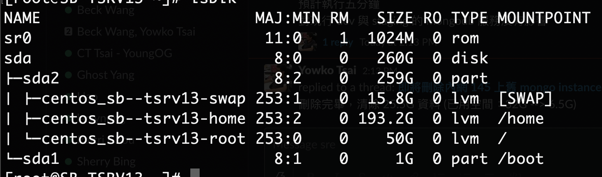

> 需要將`home`分割出`data`

## 執行步驟

1. 停止目前服務(MongoDB,MongoExporter,NodeExporter)

2. 備份所有在`/home`下的檔案

    ```shell
    cd /tmp && mkdir -p home
    cd /home
    cp -Rp * /tmp/home
    ```

3. 進行umount磁碟`/home`

    > umount /home

    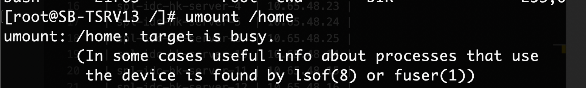

    若出現上列錯誤,需要將執行在`/home`上的Process都先停止,確認`/home`還有哪些Process
    > lsof | grep /home

    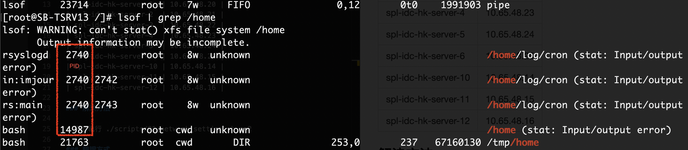

    刪除Process
    > kill -9 {{pid}}

    確認`/home`是否還有Process
    > lsof | grep /home

    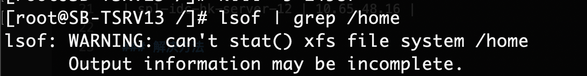

    再次進行umount
    > umount /home

    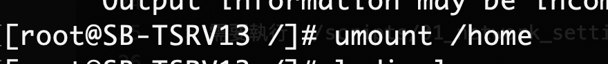

4. 進行`/home` lvreduce

    > lvreduce -L 43.2G /dev/centos_sb-tsrv13/home

    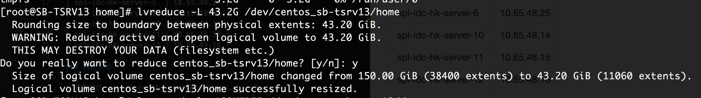

5. 進行`/data` lvcreate

    > lvcreate -L 150G -n data centos_sb-tsrv13

    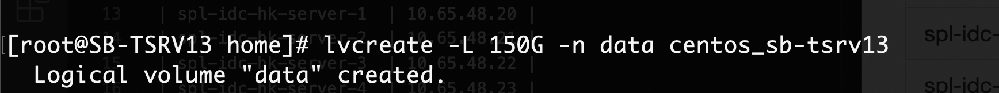

    確認lvcreate成功
    > lvdisplay

    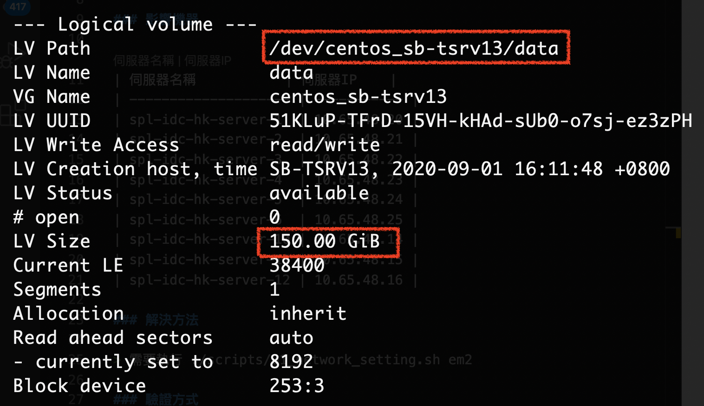

6. 格式化 lv data

    > mkfs.xfs -f /dev/centos_sb-tsrv13/data

    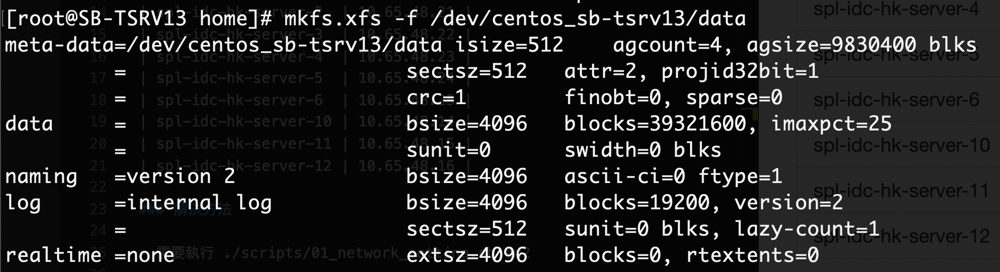

    確認disk已經可以被mount

    > lsblk

    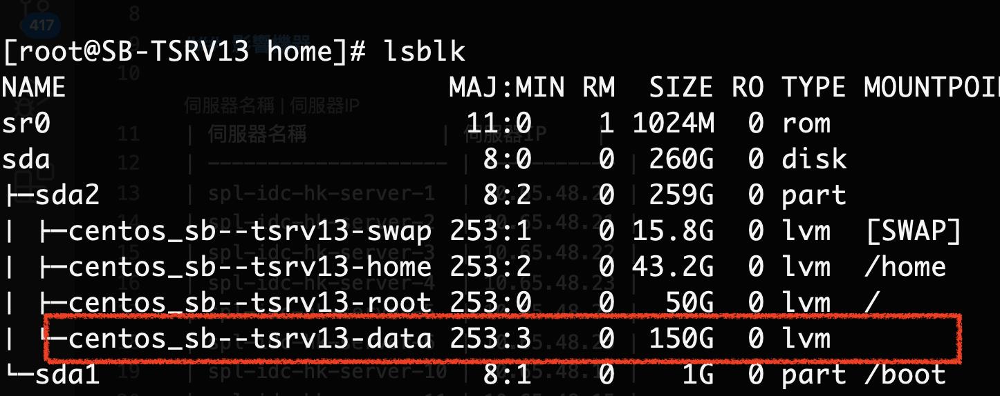

7. Mount 150G `/data`

    ```shell
    cd / && mkdir -p /data
    mount /dev/centos_sb-tsrv13/data /data/
    ```

    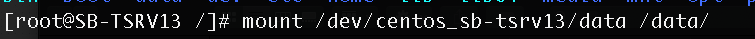

    確認mount是否完成
    > lsblk
    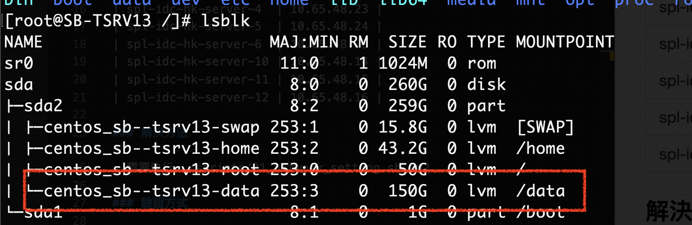

8. 格式化 lv home

    > mkfs.xfs -f /dev/centos_sb-tsrv13/home

    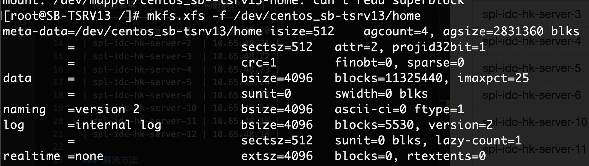

9. Mount 43.2G `/home`

    ```shell
    cd / && mkdir -p /home
    mount /dev/centos_sb-tsrv13/home /home/
    ```

    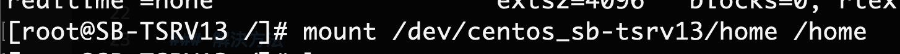

    確認mount是否完成
    > lsblk
    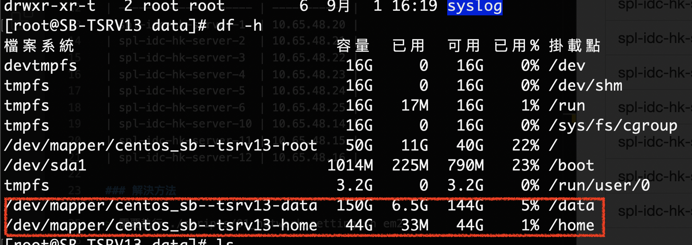

10. 確認現行的磁碟是否如預期

    > lsblk

    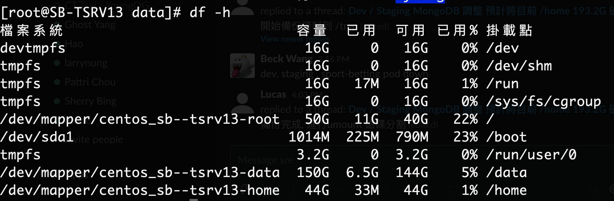

11. 新增`/data`disk 到/etc/fstab

    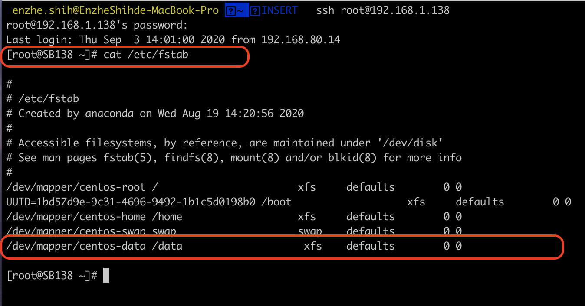
