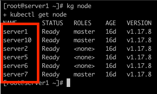
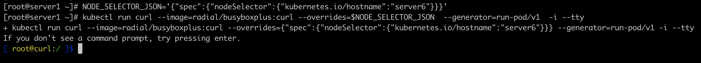
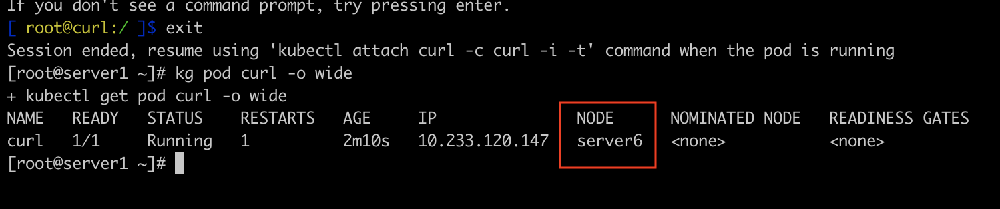
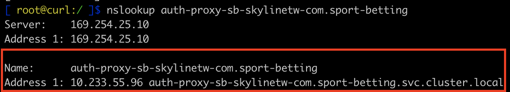
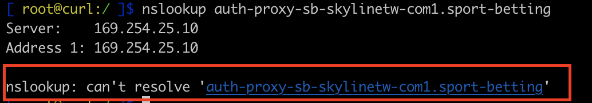
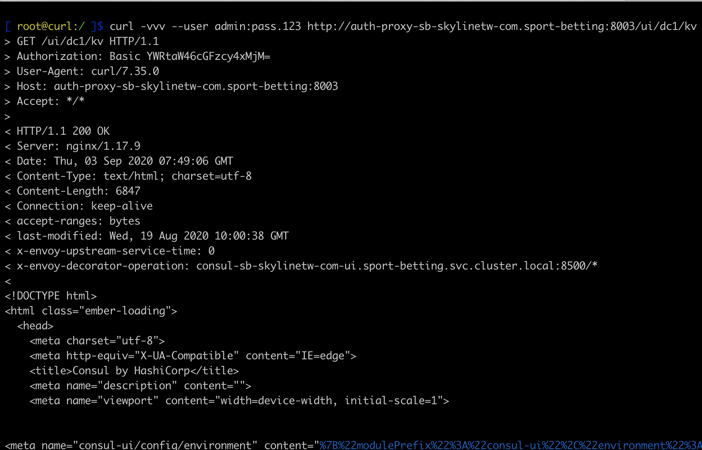
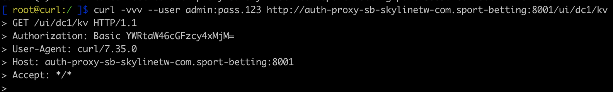
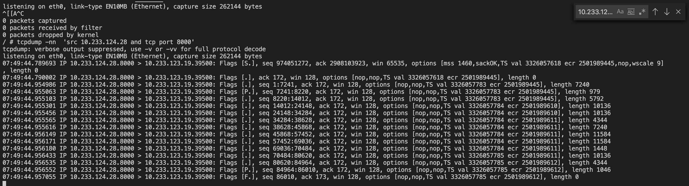
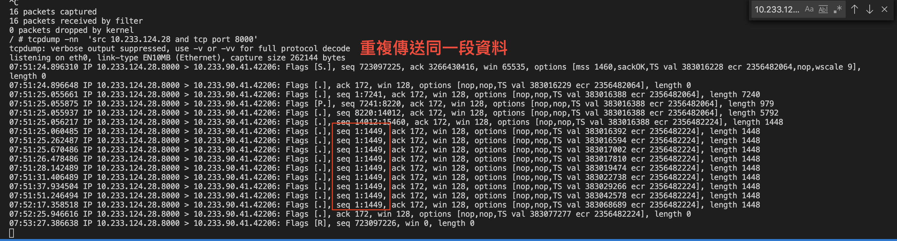

# Kubernetes Network Debug tools

## 目的

收錄協助定位Kubernetes網路問題的工具。

## 種類

### Network Debug Pod

- 說明: 包含`ping`、`curl`、`nslookup`、`traceroute`..網路工具

- 創建

  1.直接部屬

    ```shell
    kubectl run curl --image=radial/busyboxplus:curl --generator=run-pod/v1  -i --tty
    ```

  2.在特定節點部屬

  - 2.1 確認部屬節點名稱

    ```shell
    kubectl get node
    ```

    

  - 2.2 部屬在指定節點上(以server6為例)

    ```shell
    NODE_SELECTOR_JSON='{"spec":{"nodeSelector":{"kubernetes.io/hostname":"部屬節點名稱"}}}'
    kubectl run curl --image=radial/busyboxplus:curl --overrides=$NODE_SELECTOR_JSON  --generator=run-pod/v1  -i --tty
    ```

    

    2.3 驗證pod部屬節點

    ```shell
    kubectl get pod -o wide
    ```

    

  3.退出後再進入終端

    ```shell
    kubectl attach curl -c curl -i -t
    ```

- 語法

  - DNS驗證(以auth-proxy為例)

    ```shell
    nslookup {{hostname}}
    ```

    - 1.1 解析成功
        

    - 1.2 解析失敗
        

      - DNS解析失敗，通常原因為
        1. `nodelocaldns`無正常運作(以`server5`為例)

            ```
            #查詢該節點nodelocaldns log內容
            kubectl pod -n kube-system -o wide | grep nodelocal
            kubectl logs -f nodelocaldns-2gp98 -n kube-system

            #若log內容一直噴錯，刪除pod嘗試恢復服務
            kubectl delete pod nodelocaldns-2gp98 -n kube-system
            ```

        2. `iptables`路由不通
            ```
            #flush目標機器跟源機器的iptables規則，讓calico自動重建規則
            iptables -F
            ```

  - http請求驗證(以auth-proxy為例)

    ```shell
    #normal
    curl -vvv http://{{pod_ip | hostname}}:{{port}}

    #Base Auth
    curl -vvv --user {{account}}:{{pwd}}  http://{{pod_ip | hostname}}:{{port}}
    ```

    - 1.1 請求成功
        

    - 1.2 請求失敗(無響應、錯誤訊息)
        

      - 請求失敗，通常原因為
        1. `iptables`路由不通

            ```
            #flush目標機器跟源機器的iptables規則，讓calico自動重建規則
            iptables -F
            ```

        2. 重啟機器(慎用！）
            ```
            #重啟目標機器跟源機器
            reboot
            ```

### Tcpdump

- 說明: 監聽pod的流量工具

- 創建

  1. 在監聽pod上掛載tcpdump

    ```shell
    #掛載設定
    cat > tcpdump.yml << EOF
    spec:
    template:
        spec:
        containers:
        - name: tcpdump
            image: corfr/tcpdump
            command:
            - "/bin/sleep"
            - "infinity"
    EOF

    #掛載
    kubectl patch deployment {{監聽服務名稱}}} --patch "$(cat tcpdump.yml)"

    #刪除設定檔
    rm -f tcpdump.yml
    ```

- 語法

  - 監聽服務(以auth-proxy為例)

    ```shell
    tcpdump -nn -e 'src {{來源ip}} and tcp port {{port}}'
    ```

    - 1.1 收發正常
        

    - 1.2 收發異常
        

      - 收發異常，通常原因為
        1. `iptables`路由不通

            ```
            #flush目標機器跟源機器的iptables規則，讓calico自動重建規則
            iptables -F
            ```

        2. 重啟機器(慎用！）
            ```
            #重啟目標機器跟源機器
            reboot
            ```